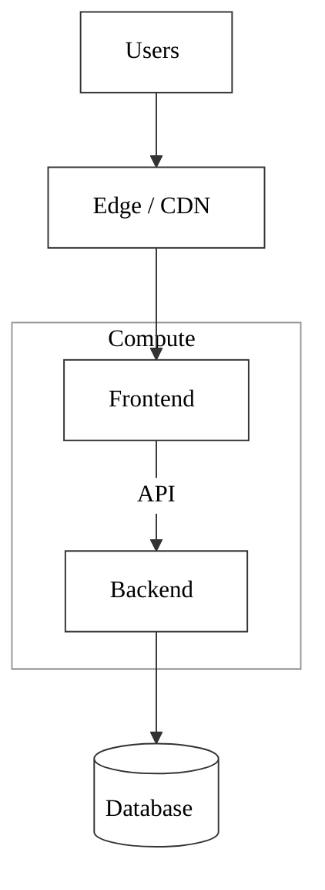
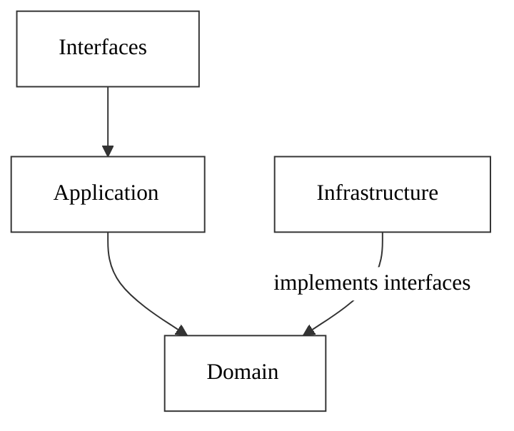
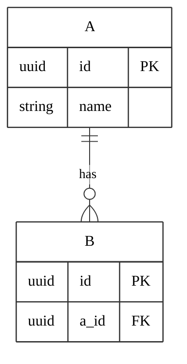
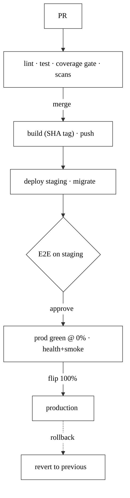

# Mermaid Snippets (monochrome)

Reusable diagram patterns for the docs. Mermaid renders in most Markdown viewers (GitHub, VS Code). Prefer diagrams over hand-aligned ASCII (which breaks easily).

## Monochrome theme directive

Prefix any diagram with this to render white/black with no color fills:

```
%%{init: {'theme':'base', 'themeVariables': {'primaryColor':'#ffffff','primaryBorderColor':'#333333','primaryTextColor':'#000000','lineColor':'#333333','clusterBkg':'#ffffff','clusterBorder':'#999999','fontFamily':'sans-serif'}}}%%
```

## Layout tips
- Prefer a clean **top-down** flow with **grouped subgraphs** over many crossing arrows.
- Combine parallel edges into one; move minor relationships to a sentence under the diagram.
- Keep node labels short; use `<br/>` for a second line.

## Pattern: system architecture (grouped)



## Pattern: layered / dependency rule



## Pattern: data model (ER)



## Pattern: CI/CD pipeline


