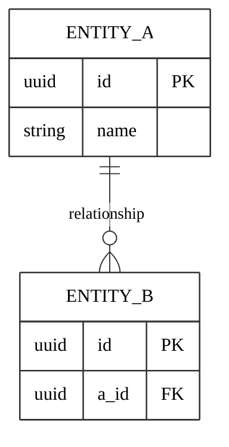

# [PROJECT NAME] — Structure & Data Models

Last updated: [YYYY-MM-DD]

This covers the surface map, data models, API, and (for web) page layout and SEO.

---

## 1. Surface / sitemap

```
[Home / root]                 /
[Index]                       /[items]/
  [Detail]                    /[items]/{slug}/
[Static page]                 /[page]/
...
[Deferred surface]            /[...]/        (PHASE 2)
```

[Navigation, redirects, canonical domain.]

---

## 2. Data models

### [Entity] (core)

| Field | Type | Notes |
|---|---|---|
| id | PK | |
| ... | | |

<!-- One table per entity. Mark deferred entities "PHASE 2". -->

### Relationships

- [Entity A] *many-to-one* [Entity B]
- [Entity A] *many-to-many* [Entity C] → join table `[a_c]`
- [Entity D] *one-to-one (optional)* [Entity E] → `D.e_id` (nullable, unique)



---

## 3. API surface

### Public / read API

```
GET  /api/[items]?page=&page_size=&q=     paginated list
GET  /api/[items]/{slug}                   detail
...
```

### Authenticated / admin API

```
POST   /api/admin/auth/login               → token
CRUD   /api/admin/[items] | /[others]
POST   /api/admin/media                     upload → storage, returns URL
```

[Contract conventions, pagination shape, auth.]

---

## 4. Page layout (web)

[Section order for key page types.]

---

## 5. SEO (web)

- Meta title / description conventions
- Canonical strategy
- Structured data (JSON-LD)
- sitemap.xml / robots.txt
- Internal linking rules

---

## 6. Open choices

1. [Choice] — [RESOLVED: …] or [open].
