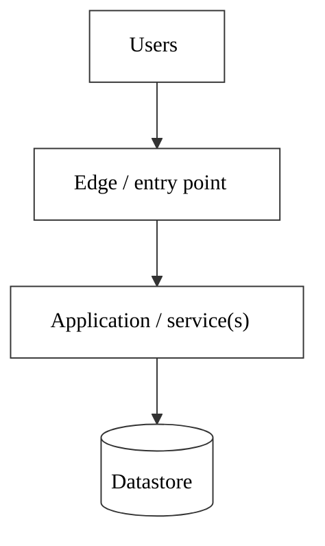
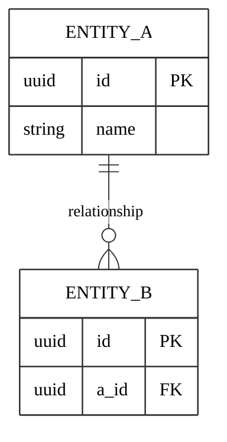
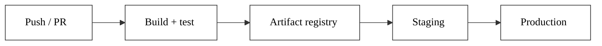

# [PROJECT NAME] — Technical Specification

**Status:** Draft
**Date:** [YYYY-MM-DD]
**Owner:** [Name]
**Related:** `../DECISIONS.md`, `STRUCTURE.md`, `adr/`

This specification describes how [PROJECT NAME] is built and operated. The *why* behind each major choice is in the ADRs (`adr/`); the running decision summary is in `DECISIONS.md`.

---

## 1. Overview

[What the system is. Primary goals. Fixed constraints (language, cloud, budget, deadline, compliance).]

---

## 2. Architecture overview



[Short narrative. List components and reference the relevant ADRs.]

---

## 3. Components

### 3.1 [Component / service name]
- [Language, framework, key libraries.]
- [Internal structure / pattern. If layered or DDD, show the layout and dependency rule.]

### 3.2 [Component / service name]
- [...]

---

## 4. Data model

[Summary of entities and relationships. Full field detail in `STRUCTURE.md`.]



---

## 5. API design

[Surfaces (public/admin/etc.), contract conventions, pagination, auth.]

---

## 6. Infrastructure

| Concern | Service / tool | Notes |
|---|---|---|
| Compute | [ ] | [ ] |
| Datastore | [ ] | [ ] |
| Storage | [ ] | [ ] |
| Edge / CDN | [ ] | [ ] |
| Secrets | [ ] | [ ] |
| Region | [ ] | [ ] |

[Secrets handling, IaC tool.]

### Containerization

All Docker assets live under a `docker/` folder — one subfolder per configuration when there is more than one. Fill in the actual layout:

```
docker/
  [config]/
    Dockerfile
    docker-compose.yml
```

---

## 7. CI/CD

- **Source control:** [ ]
- **Pipelines:** [ ]
- **Environments:** [ ]
- **Migrations:** [ ]



---

## 8. Testing strategy

[If a methodology was chosen (e.g. TDD), describe the test pyramid and tools.]

| Layer | Scope | Tools |
|-------|-------|-------|
| Unit | [ ] | [ ] |
| Integration | [ ] | [ ] |
| E2E | [ ] | [ ] |

---

## 9. Cross-cutting concerns

### Security
- [ ]

### Observability & logging
- [ ]

### Performance
- [ ]

<!-- For web projects, add an SEO subsection. -->

---

## 10. Resolved / open technical choices

1. [Choice] — [RESOLVED: …] or [open: options].

---

## 11. Out of scope

- [Explicit non-goals.]
