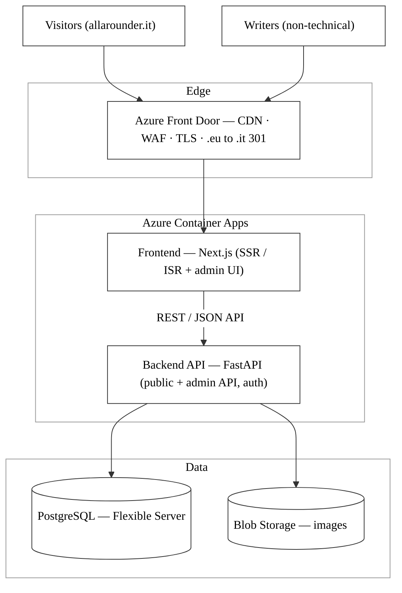
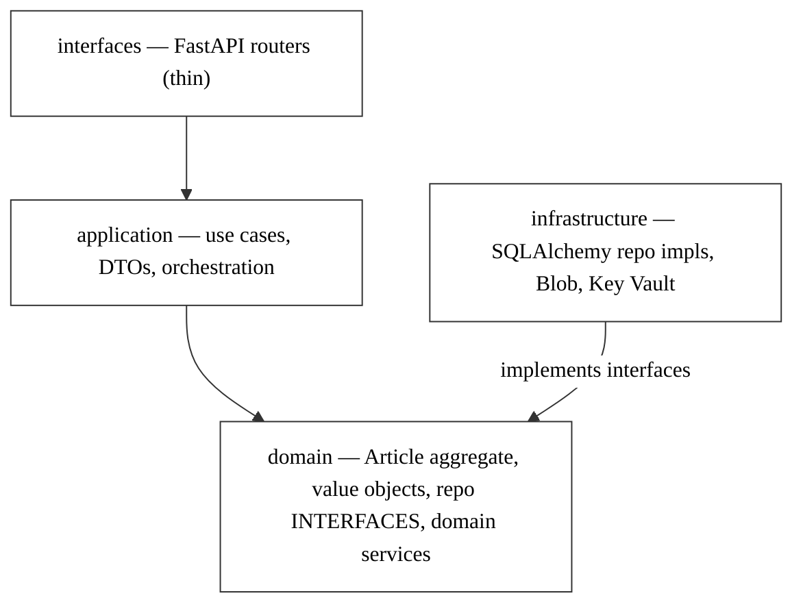
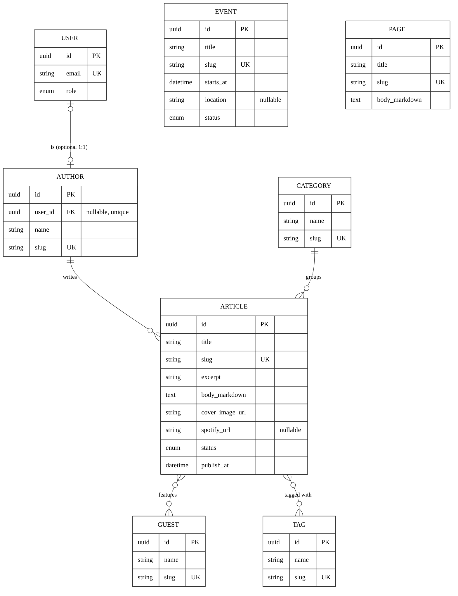
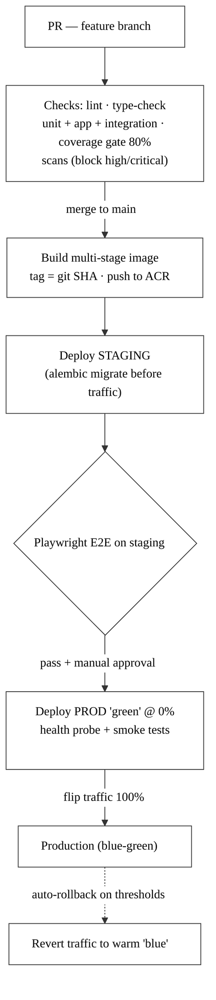

# Allarounder — Technical Specification

**Status:** Draft
**Date:** 2026-06-14
**Owner:** Guido (lead developer)
**Related:** `../DECISIONS.md`, `SITE-STRUCTURE.md`, `adr/`

This specification describes how the Allarounder website is built and operated. It is the engineering reference for the system; the *why* behind each major choice is in the ADRs (`adr/`), and the running decision summary is in `DECISIONS.md`.

---

## 1. Overview

Allarounder is a written-articles blog that promotes an Italian podcast hosted on Spotify. The site publishes articles in Italian; each article links out to the related Spotify episode. **No audio is hosted on the site** — there is no player backend, streaming, or RSS feed to build.

**Primary goals:** be fast and SEO-friendly (to rank in Italian search and drive readers to Spotify), and give three non-technical writers a usable authoring tool.

**Fixed constraints:** Python, Azure, Italian-only content, canonical domain `allarounder.it`.

---

## 2. Architecture overview

Two independently deployed services plus managed Azure resources:



Images stored in Blob Storage are served to visitors through Front Door's CDN. **Cross-cutting services:** Azure Key Vault (secrets) · Application Insights (telemetry) · Azure Container Registry (images) · GitHub Actions (CI/CD).

- **Frontend** (`src/frontend/`, Next.js): renders the public Italian site with SSR/ISR for SEO; consumes the public read API. Hosts (or routes to) the custom admin UI for writers.
- **Backend** (`src/backend/`, FastAPI): a JSON API with two surfaces — a public read API and an authenticated admin API. Owns persistence and media upload.
- **Data**: Azure PostgreSQL (relational content), Azure Blob Storage (images only).
- **Edge**: Azure Front Door for global delivery, TLS, and the `.eu → .it` redirect.
- **Region**: Italy North (EU data residency, low latency for Italian users).

See ADR-0001 (FastAPI), ADR-0002 (Next.js), ADR-0003 (custom admin), ADR-0004 (Container Apps), ADR-0005 (PostgreSQL), ADR-0006 (monorepo), ADR-0007 (domains), ADR-0008 (DDD), ADR-0009 (TDD), ADR-0010 (logging).

---

## 3. Components

### 3.1 Backend (FastAPI, Domain-Driven Design)
- Python + FastAPI, served by Uvicorn/Gunicorn in a container.
- SQLAlchemy (ORM) + Alembic (migrations).
- Pydantic models for request/response schemas; auto-generated OpenAPI docs.
- Auth: OAuth2 password flow + JWT; password hashing with argon2/bcrypt; roles `admin` and `editor`.
- Media: streams uploads to Blob Storage, stores returned URLs on records.

The backend follows **pragmatic Domain-Driven Design** (ADR-0008): tactical patterns inside a single core **Content/Publishing** bounded context, organized in layers with a strict inward dependency rule.

```
src/backend/
├── content/                     # Content/Publishing bounded context
│   ├── domain/                  # framework-free core
│   │   ├── article.py           #   Article aggregate root + lifecycle invariants
│   │   ├── value_objects.py     #   Slug, SpotifyUrl, Seo, PublicationStatus
│   │   ├── repositories.py      #   repository INTERFACES (ports)
│   │   ├── services.py          #   domain services (publishing/scheduling rules)
│   │   └── errors.py            #   domain errors
│   ├── application/             # use cases (commands/queries), DTOs, orchestration
│   ├── infrastructure/          # SQLAlchemy repo impls, Blob storage, mappers
│   └── interfaces/              # FastAPI routers (thin: HTTP <-> application)
├── identity/                    # supporting context: auth, users, roles
├── newsletter/                  # supporting context: subscribers
├── shared/                      # cross-context primitives, config, Key Vault access
└── main.py                      # app wiring / dependency injection
```

**Dependency rule** — everything points inward to `domain`, which depends on nothing framework-related:



- **Aggregate:** `Article` owns its invariants and lifecycle transitions (draft → scheduled → published).
- **Value objects:** `Slug`, `SpotifyUrl`, `Seo`, `PublicationStatus` encapsulate validation.
- **Repository pattern:** interfaces in `domain/`, SQLAlchemy implementations in `infrastructure/`; domain objects are mapped to/from ORM models so the domain layer imports no framework code.
- **Identity** and **Newsletter** start minimal and graduate to fuller contexts only if complexity warrants (ADR-0008).

### 3.2 Frontend (Next.js)
- Renders public pages via SSR/ISR; revalidates article pages on publish.
- Generates `sitemap.xml`, `robots.txt`, JSON-LD `Article` schema, canonical tags to `.it`.
- Custom admin UI: authenticated SPA-style area for writers (article CRUD, Markdown editor, cover-image upload, Spotify link, publish/schedule).

### 3.3 Data stores
- **PostgreSQL** — all structured content (see §4).
- **Blob Storage** — cover and guest images only (no audio).

---

## 4. Data model

Full field-level detail is in `SITE-STRUCTURE.md §2`. Summary:

- **Article** (core): title, slug, excerpt, body (Markdown — see §10), cover_image_url, cover_image_alt, **spotify_url** *(nullable — standalone articles allowed)*, status (`draft`/`scheduled`/`published`), publish_at, author_id, category_id, SEO fields (meta_title, meta_description, og_image_url), reading_time, timestamps.
- **Author**, **Category** (seed: Interviste/Analisi/Roundtable/Out of the Box), **Tag**, **Guest**, **Event** (simple, v1), **Page** (static), **User** (login accounts). *(NewsletterSubscriber is phase 2.)*
- Relationships: Article → Author (M:1), Article → Category (M:1), Article ↔ Guest (M:N), Article ↔ Tag (M:N), Author → User (optional 1:1 via `Author.user_id`). Event is standalone.
- **No Episode/audio model** — the Spotify link is an optional URL field on Article.



*v1 entities shown. NewsletterSubscriber is phase 2 (see DECISIONS.md). Migrations are managed with Alembic; local development uses a local PostgreSQL instance for parity.*

---

## 5. API design

Full endpoint list in `SITE-STRUCTURE.md §3`. Two surfaces:

- **Public read API** — published content only (filters `status = published AND publish_at <= now`): articles (list/detail, paginated), categories, tags, guests, authors, events, pages, search. *(Newsletter subscribe is phase 2.)*
- **Admin API** (auth required) — login; full CRUD for articles (incl. drafts/scheduled), categories, tags, guests, authors, events, pages; media upload; publish/schedule.

Contract: JSON over REST; paginated responses as `{ items, total, page, page_size }`. The OpenAPI schema is the source of truth for the frontend.

---

## 6. Infrastructure (Azure)

| Concern | Service | Notes |
|---|---|---|
| Compute | **Azure Container Apps** | One app each for backend and frontend; autoscaling |
| Image registry | **Azure Container Registry (ACR)** | Built/pushed by CI |
| Database | **Azure Database for PostgreSQL** (Flexible Server) | Italy North |
| Image storage | **Azure Blob Storage** | Cover/guest images |
| Edge / CDN | **Azure Front Door** | Global delivery, TLS, WAF, `.eu → .it` 301 |
| Secrets | **Azure Key Vault** | DB connection string, JWT signing key, storage keys |
| Monitoring | **Application Insights** | Traces, errors, performance |
| Region | **Italy North** | EU residency, low latency |

Secrets are never committed; the apps read them from Key Vault (or Container Apps secrets bound to Key Vault). Infrastructure is captured as IaC with **Bicep** in `infra/` (decided). Key Vault is provisioned via Bicep, but secret *values* are injected through a secure step, never committed.

---

## 7. CI/CD (see ADR-0012)

- **Source control & branching:** GitHub, single **monorepo** (ADR-0006), **GitHub Flow** — `main` plus short-lived feature branches via PR; `main` is always deployable.
- **Branch protection (ADR-0014):** a GitHub Ruleset (`enforcement: active`, id 17948951) on `refs/heads/main` blocks direct pushes, force-pushes, and deletion; requires a PR with all 6 CI status checks passing before merge. Supplemented by **Claude Code git guardrails** (`.claude/hooks/block-dangerous-git.sh`). Add admin as bypass actor via GitHub UI (`Settings → Rules → Rulesets → Protect main → Bypass list`) for non-code PRs.
- **Triggers:** PR → checks only (no deploy); merge to `main` → deploy **staging**; **production via manual approval** (GitHub Environment protection rule), restricted to `main`/release tags.
- **Pipelines:** GitHub Actions, two **path-filtered** workflows (`src/backend/**`, `src/frontend/**`), each running:
  1. **Lint & type-check** — Ruff + Black + mypy (backend); ESLint + Prettier + `tsc`/`next build` (frontend).
  2. **Test (tiered)** — unit + application + frontend-unit + **integration** (testcontainers; hosted runners include Docker) with an **80% coverage gate** (domain/application near 100%) **before** the image builds. **Playwright E2E** runs post-deploy on staging as the promotion gate.
  3. **Security scans** — dependency audit (pip-audit, npm audit, Dependabot) + secret scanning (gitleaks + push protection) + container image scan (Trivy) + SAST (CodeQL); **block on high/critical**.
  4. **Build** — multi-stage Dockerfile; tag with **immutable git SHA** (+ **semver** on release); push to **ACR**; deploy by **digest**.
  5. **Deploy** — staging on merge; **blue-green** flip to production after approval.
- **Auth to Azure:** **OIDC federated credentials** — GitHub presents a signed, short-lived token (claims: repo/branch/environment) verified by Azure against a federated credential; no secrets stored in GitHub. The prod identity is assumable only from the protected `production` environment.
- **Runtime secrets:** **Key Vault references via managed identity** — each Container App reads secrets directly from Key Vault using its Azure identity; values never pass through CI.
- **Migrations:** a **dedicated job runs `alembic upgrade head` before traffic shifts**, rehearsed on staging; schema changes follow **expand/contract** (backward-compatible) with **roll-forward** — no down-migrations.
- **Deployment strategy (blue-green):** deploy the new revision (“green”) at **0% traffic**; gate the flip on **health/readiness probe + smoke tests** against green; shift 100% via revision weights. **Rollback** = revert traffic to the warm previous revision (“blue”); **automated rollback** on health/error-rate/latency thresholds (conservative initially, with manual alert-driven revert as fallback until baselines exist). **Canary is phase 2.**
- **Environments:** **separate `staging` and `production`** (each its own Container Apps environment, database, and config), both stamped from the same Bicep with different parameters.
- **Hygiene:** dependency + Docker layer caching; **concurrency** cancellation of superseded runs; failure/deploy notifications.



---

## 8. Testing strategy (TDD)

Development follows **Test-Driven Development** (red → green → refactor); tests are written before implementation and live alongside the code (ADR-0009). The suite is shaped as a **test pyramid** — many fast tests at the base, few slow ones at the top.

| Layer | Scope | Tools |
|-------|-------|-------|
| Domain unit | `Article` aggregate, value objects, domain services — no I/O | pytest |
| Application | Use cases against fake/in-memory repositories | pytest |
| Integration | Repository implementations + migrations against **real PostgreSQL** | pytest + **testcontainers** |
| API / contract | Endpoints, request/response, auth, OpenAPI conformance | httpx / schemathesis |
| Frontend unit | Components, hooks | Vitest + React Testing Library |
| E2E | Critical visitor and editor flows | Playwright |

- The framework-free `domain/` layer (ADR-0008) makes domain tests fast and trivial, which is what makes TDD practical here.
- **CI gate:** both GitHub Actions workflows (§7) run their test suite with a coverage threshold **before** building/pushing images. testcontainers requires Docker in the CI runner.
- **Tiering (ADR-0012):** unit + application + frontend-unit + **integration** run on every PR (with the 80% coverage gate before image build); **E2E (Playwright)** runs post-deploy on staging as the production-promotion gate.

## 9. Cross-cutting concerns

### Security (see ADR-0013)

**Auth**
- JWT stored in **`httpOnly`, `Secure`, `SameSite=Strict` cookies** — JS never reads the token.
- **30-min access token + 14-day rotating refresh token** (`refresh_tokens` table); revoked on logout, password change, or by admin.
- Passwords hashed with **argon2**; **12-char minimum**, HaveIBeenPwned breach check, soft lockout after 10 failures (5-min cooldown).

**Authorization**
- Roles `admin` and `editor` enforced as FastAPI dependencies (`Depends(require_admin)`, `Depends(require_editor_owns_resource)`).
- Editors manage only their own content; admins have cross-author edit, delete, and user management.
- All `/admin/:path*` routes protected by **Next.js Middleware** (`middleware.ts`) using `jose`; unauthenticated requests redirect to `/admin/login`.

**Network**
- HTTPS everywhere (Front Door managed certs for both domains; HSTS at Front Door).
- **CORS** — explicit allowlist (`allarounder.it` + staging); `allow_credentials=True`; no wildcard.
- **Rate limiting** — WAF (1 000 req/min/IP) + `slowapi` per-endpoint: login 10/min, refresh 20/min, search 60/min, upload 10/min/user.
- **WAF** — `Microsoft_DefaultRuleSet_2.1` (OWASP Top 10); Detection mode at launch → Prevention after burn-in; provisioned in Bicep.

**Content safety**
- **Image uploads:** magic-bytes validation (`python-magic`); JPEG/PNG/WebP/GIF only (SVG rejected); 10 MB limit; explicit `Content-Type` on Blob write.
- **Markdown rendering:** `remark-rehype (allowDangerousHtml: false)` → `rehype-sanitize` — raw HTML in article bodies is not supported.
- **HTTP headers** in `next.config.js`: `X-Content-Type-Options: nosniff`, `X-Frame-Options: DENY`, `Referrer-Policy: strict-origin-when-cross-origin`, `Permissions-Policy`. CSP deferred to post-launch hardening.

**Secrets & infra**
- Postgres and Blob Storage accessed via **managed identity** (`DefaultAzureCredential`) — no passwords or storage keys in Key Vault.
- Key Vault holds only the **JWT signing key**. CI uses OIDC federated credentials (ADR-0012) — no long-lived secrets in GitHub.
- **Blob Storage container is private**; images served exclusively through Front Door (`cdn.allarounder.it/...`).

**Deferred**
- Content-Security-Policy (post-launch hardening pass).
- Audit logging (`audit_log` table) — phase 2.

### Observability & logging (see ADR-0010)
- **Instrumentation:** OpenTelemetry in both apps, exporting to **Azure Monitor / Application Insights** (Log Analytics workspace, Italy North).
- **Log format:** structured **JSON** to stdout (Python: structlog / JSON formatter; Next.js: pino); Container Apps ships stdout to Log Analytics.
- **Distributed tracing:** propagate W3C `traceparent` from frontend to backend; every log line carries the trace/correlation ID for end-to-end request tracing.
- **Levels:** INFO+ in production, DEBUG in development (config-driven).
- **Privacy (GDPR):** redact secrets/tokens/passwords, full request bodies, and PII (subscriber emails, unneeded IPs) at the logging boundary. Tests assert no secrets/PII are emitted (ADR-0009).
- **DDD:** logging lives in `application`/`interfaces`/`infrastructure` via middleware + a logging port; the `domain` layer stays logging-free.
- **Health:** liveness/readiness endpoints back Container Apps probes.
- **Retention:** Log Analytics retention set to a defined window (default 30–90 days), provisioned via Bicep.

### SEO (product-critical)
- SSR/ISR rendering; `Article` JSON-LD; canonical tags to `.it`; `sitemap.xml`/`robots.txt`; Italian slugs; per-article meta title/description and OG image; ≥2 internal links per article.

### Performance
- ISR + Front Door caching for article pages; images served from Blob via Front Door; pagination on list endpoints.

---

## 10. Key technical choices (resolved 2026-06-14)

1. ~~**Article body format**~~ — **RESOLVED: Markdown** (stored as plain text; toolbar+preview editor in the custom admin; rendered by Next.js; modeled as a `Body` value object). See DECISIONS.md.
2. ~~**IaC tool**~~ — **RESOLVED: Bicep** for `infra/`. See DECISIONS.md.
3. ~~**Scheduling**~~ — **RESOLVED: read-time filter** (`publish_at <= now`), no scheduler service in v1; scheduled posts appear within the cache-revalidation window. See DECISIONS.md.
4. ~~**v1 scope vs phase 2**~~ — **RESOLVED**: v1 = articles, categories, tags, guests, cover image, Spotify link, custom admin, SEO. Phase 2 = newsletter, comments. See DECISIONS.md.
5. ~~**Staging environment**~~ — **RESOLVED**: a fully separate staging environment (own Container Apps env, DB, config), stamped via Bicep alongside production. See DECISIONS.md.

---

## 11. Out of scope

- Hosting or streaming audio (lives on Spotify).
- RSS podcast feed.
- Multilingual / i18n (content is Italian-only).
- User accounts for the public (only editorial/admin accounts exist).

---

## Appendix: open product inputs

Product-level details (podcast topic, audience, success metrics, launch timeline) are being collected from the content team via `../product/content-team-questionnaire.md` and will land in the PRD. They do not block the engineering work described here.
